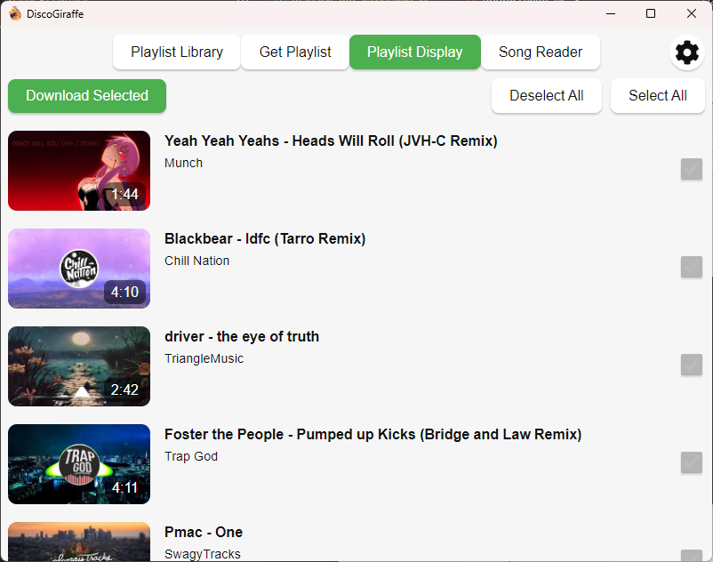
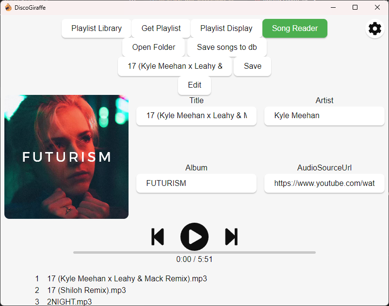

    

# DiscoGiraffe

## A music library manager for YouTube downloads.

    
    

### Requirements

- [yt-dlp](https://github.com/yt-dlp/yt-dlp)
- [ffmpeg](https://ffmpeg.org/)

Plan is to embed these in the future if possible.

### Development

Necessary dependencies: [Rust](https://www.rust-lang.org/), [Node.js](https://nodejs.org/en), [PNPm](https://pnpm.io/)

Recommended IDE Setup:
[VS Code](https://code.visualstudio.com/) + [Svelte](https://marketplace.visualstudio.com/items?itemName=svelte.svelte-vscode) + [Tauri](https://marketplace.visualstudio.com/items?itemName=tauri-apps.tauri-vscode) + [rust-analyzer](https://marketplace.visualstudio.com/items?itemName=rust-lang.rust-analyzer).

#### Setup

1. Clone the repo `git clone https://github.com/fhlmorrison/discogiraffe.git`
2. `cd discogiraffe`
3. `pnpm install`
4. `pnpm tauri dev`
